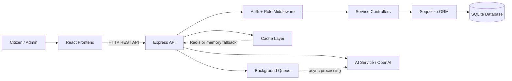
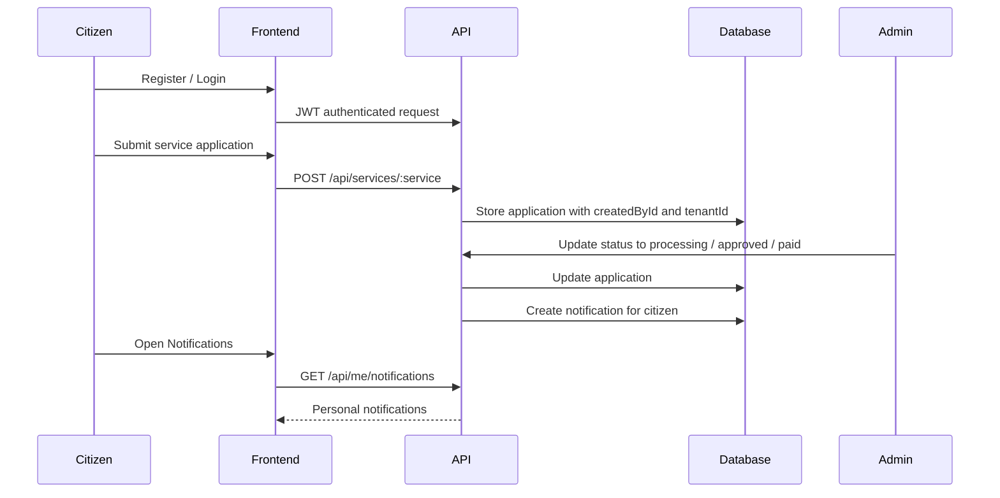
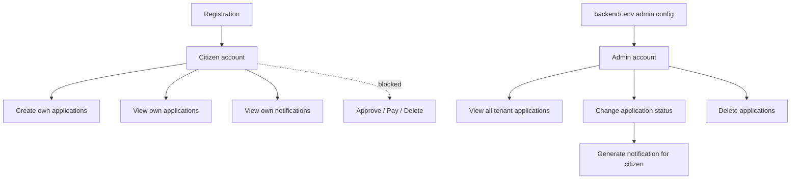
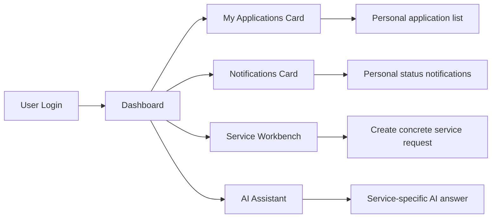
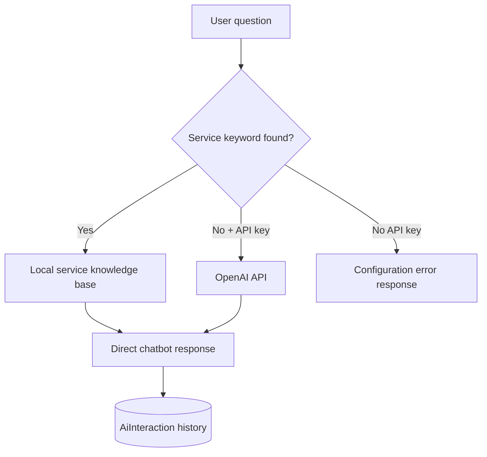
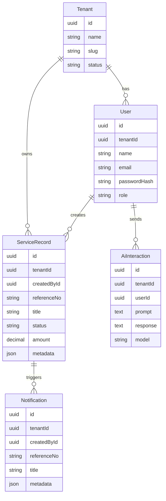

# SSH_Gr32

> Distributed Electronic Services Platform for **Sistemet e Shperndara 2025/26**


SSH_Gr32 is a professional client-server platform for digital public services. Citizens can register, submit service applications, track their own requests and receive notifications when an administrator changes application status. Administrators can manage all applications across tenants.

The project is built as a distributed system: the React client and Express server are independent and communicate only through REST API calls.

## Project Overview

| Area | Implementation |
| --- | --- |
| Architecture | Independent client-server workspaces |
| Communication | HTTP REST API under `/api` |
| Backend | Node.js, Express.js, Sequelize ORM |
| Frontend | React, Vite, Context API |
| Database | SQLite through Sequelize models and migrations |
| Authentication | JWT + bcrypt |
| Authorization | Role-based access control |
| Documentation | Swagger UI |
| AI | Local service knowledge base + optional OpenAI API |
| Caching | Redis-compatible cache with memory fallback |
| Async work | BackgroundQueue |
| Testing | Jest, Supertest, frontend production build |

## Architecture



## User and Admin Flow



## Role-Based Access



Public registration always creates a `citizen`. Users cannot register themselves as admin. The admin user is created from environment configuration when the backend starts.

## Features

- Client-server architecture with separated `frontend/` and `backend/`
- RESTful API built with Express.js
- Swagger UI for API documentation and testing
- JWT authentication and bcrypt password hashing
- Role-based authorization for `citizen` and `admin`
- Multi-tenancy using `tenantId`
- Citizen-only personal data access
- Admin access to all service applications
- Personal application counter in the dashboard
- Application list modal for each logged-in user
- Notifications when admin changes application status
- AI chatbot with predefined service answers
- Optional OpenAI API integration
- Redis-compatible caching with memory fallback
- Background jobs for asynchronous processing
- Search and filtering with `q`, `status`, `limit`, `offset`
- 20+ models and migrations
- Jest/Supertest API tests
- React + Context API frontend

## Project Structure

```text
SSH_Gr32/
├── backend/
│   ├── migrations/       # Sequelize migration files
│   ├── src/              # API source code
│   ├── tests/            # Jest + Supertest API tests
│   ├── .env.example      # Environment template
│   └── package.json
├── frontend/
│   ├── src/              # React application
│   ├── index.html
│   ├── vite.config.js
│   └── package.json
├── .github/              # CI/CD and GitHub templates
├── docker-compose.yml    # Redis service
├── package.json          # Workspace scripts
├── package-lock.json
└── README.md
```

## Technology Stack

| Layer | Technologies |
| --- | --- |
| Frontend | React, Vite, Context API, lucide-react, CSS |
| Backend | Node.js, Express.js |
| ORM | Sequelize |
| Database | SQLite |
| Auth | JWT, bcrypt |
| API Docs | Swagger UI |
| AI | OpenAI SDK + local knowledge base |
| Cache | Redis / node-cache fallback |
| Tests | Jest, Supertest |
| CI/CD | GitHub Actions |

## Installation

```bash
cd "/Users/diellakika/Documents/GitHub/untitled folder/SSH_Gr32"
npm install --workspaces
cp backend/.env.example backend/.env
```

## Environment Variables

Configure `backend/.env`:

```env
HOST=127.0.0.1
PORT=5001
JWT_SECRET=change-this-secret-before-production
DATABASE_STORAGE=./data/ssh-gr32.sqlite
CLIENT_ORIGIN=http://127.0.0.1:5176
OPENAI_API_KEY=
OPENAI_MODEL=gpt-4o-mini
REDIS_URL=redis://127.0.0.1:6379
ADMIN_EMAIL=admin@ssh-gr32.local
ADMIN_PASSWORD=Admin12345!
ADMIN_NAME=System Administrator
ADMIN_TENANT_NAME=SSH_Gr32 Administration
ADMIN_TENANT_SLUG=ssh-gr32-admin
```

## Running the Project

Start the backend:

```bash
cd "/Users/diellakika/Documents/GitHub/untitled folder/SSH_Gr32"
HOST=127.0.0.1 PORT=5001 npm --workspace backend start
```

Start the frontend in another terminal:

```bash
cd "/Users/diellakika/Documents/GitHub/untitled folder/SSH_Gr32"
VITE_API_URL=http://127.0.0.1:5001/api npm --workspace frontend run dev
```

Open:

| Service | URL |
| --- | --- |
| Frontend | `http://127.0.0.1:5176` |
| Backend API | `http://127.0.0.1:5001/api` |
| Swagger UI | `http://127.0.0.1:5001/api-docs` |

If ports are already in use:

```bash
lsof -ti:5001 | xargs kill
lsof -ti:5176 | xargs kill
```

## Authentication

| Endpoint | Description |
| --- | --- |
| `POST /api/auth/register` | Register a new citizen |
| `POST /api/auth/login` | Login and receive JWT token |
| `GET /api/auth/me` | Return authenticated user |

## Roles

| Role | Permissions |
| --- | --- |
| `citizen` | Create applications, view own applications, view own notifications |
| `admin` | View all applications, update status, delete applications, view AI history/jobs |

## Services

The platform supports concrete electronic services:

| Service | Purpose |
| --- | --- |
| Passport application | Apply for an electronic passport |
| Water bill payment | Submit a KRU water bill payment |
| Electricity bill payment | Submit a KESCO electricity payment |
| Tax declaration | Submit tax declaration data |
| Health appointment | Book a healthcare appointment |
| Citizen complaint | Submit a public service complaint |
| Civil document request | Request civil documents |
| Vehicle registration | Register a vehicle request |
| Property tax payment | Submit property tax payment |
| Scholarship application | Apply for education support |
| Police report | Submit police-related report |
| Family certificate | Request family certificate |
| Donation | Submit donation request |
| Citizen profile | Store citizen information |

Each application record contains:

```text
tenantId
createdById
referenceNo
title
status
amount
metadata
createdAt
updatedAt
```

Application statuses:

```text
draft
submitted
processing
approved
rejected
paid
```

## Dashboard Features



## Notifications

Notifications are created automatically when an admin changes an application status.

| Step | Action |
| --- | --- |
| 1 | Citizen submits application |
| 2 | Admin reviews application |
| 3 | Admin changes status |
| 4 | Backend creates notification |
| 5 | Citizen sees notification in dashboard |

Endpoint:

```text
GET /api/me/notifications
```

## AI Chatbot



AI endpoints:

| Endpoint | Description |
| --- | --- |
| `POST /api/ai/chat` | Returns direct chatbot response |
| `POST /api/ai/analyze` | Starts background analysis job |
| `GET /api/ai/history` | Returns AI interaction history |

The local knowledge base supports service-specific answers for passports, water bills, electricity bills, tax declarations, appointments, complaints, documents, vehicles, property, scholarships, police reports, family certificates and donations.

## Search and Filtering

Service endpoints support:

| Parameter | Description |
| --- | --- |
| `q` | Search by title or reference number |
| `status` | Filter by status |
| `limit` | Limit returned records |
| `offset` | Pagination offset |

Example:

```text
GET /api/services/waterBills?q=KRU&status=submitted&limit=10&offset=0
```

## Main API Endpoints

| Method | Endpoint | Description |
| --- | --- | --- |
| GET | `/api/health` | Health check |
| POST | `/api/auth/register` | Register citizen |
| POST | `/api/auth/login` | Login |
| GET | `/api/auth/me` | Current user |
| GET | `/api/me/stats` | Personal application stats |
| GET | `/api/me/notifications` | Personal notifications |
| POST | `/api/ai/chat` | AI chatbot |
| POST | `/api/ai/analyze` | Background AI analysis |
| GET | `/api/ai/history` | AI history |
| GET | `/api/jobs` | Background jobs |
| GET | `/api/services/:service` | List service records |
| POST | `/api/services/:service` | Create service record |
| GET | `/api/services/:service/:id` | Get service record |
| PUT | `/api/services/:service/:id` | Admin update |
| DELETE | `/api/services/:service/:id` | Admin delete |
| GET | `/api-docs` | Swagger UI |

Because each service has CRUD endpoints, the project provides more than 20 API endpoints.

## Database Models



Main implemented models:

```text
Tenant, User, AiInteraction, Citizen, Address, DocumentRequest,
ElectronicPassport, FamilyCertificate, HealthAppointment,
FamilyDoctorSelection, EducationApplication, ProjectApplication,
VehicleRegistration, VehicleInspection, PoliceReport, CourtConfirmation,
PropertyPayment, WaterBill, ElectricityBill, TaxDeclaration, Donation,
ConsularStamp, AuditRequest, Complaint, Notification
```

## Testing

Run backend tests:

```bash
npm --workspace backend test
```

Build frontend:

```bash
npm --workspace frontend run build
```

## Requirements Coverage

| # | Requirement | Implementation |
| --- | --- | --- |
| 1 | Client-server architecture | Separate `frontend/` and `backend/` |
| 2 | HTTP/REST communication | REST API under `/api` |
| 3 | Minimum 20 endpoints | CRUD endpoints for all services + system endpoints |
| 4 | REST framework | Express.js |
| 5 | OOP | Controllers, services, middleware, model registry |
| 6 | Swagger | `/api-docs` |
| 7 | ORM and database | Sequelize + SQLite |
| 8 | Authentication and authorization | JWT + role-based access |
| 9 | Middleware | Auth, authorization, logger, errors, CORS, Helmet, rate limit |
| 10 | React + Context API | React frontend with AuthContext |
| 11 | Testing + CI/CD | Jest, Supertest, GitHub Actions |
| 12 | 20+ models/migrations | 25 Sequelize models and migration files |
| 13 | Project documentation | README + Swagger |
| 14 | Project management | GitHub templates and workflow structure |
| 15 | Git collaboration | Pull request template, issue templates, CODEOWNERS |
| 16 | OpenAI integration | AI service with OpenAI SDK |
| 17 | Caching | Redis-compatible caching with memory fallback |
| 18 | Background jobs | BackgroundQueue |
| 19 | Multi-tenancy | Tenant-scoped data separation |
| 20 | Search/filtering | `q`, `status`, `limit`, `offset` |

## License

MIT

